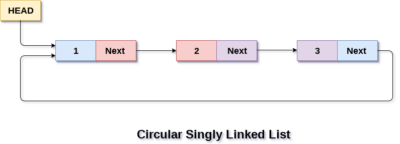
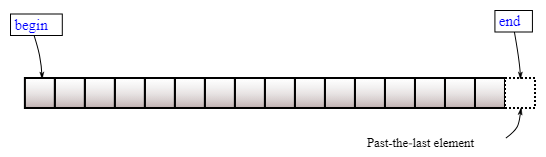

# Связные списки

**Связный список** -- структура данных, представляющая собой связанные друг за другом узлы.

### Двусвязный список

Самый распространенный и самый полезный из видов списков. Двусвязность значит, что
узлы связаны с следующими и предыдущими соседями.


#### Алгоритмическая сложность

- Вставка элемента в начало или конец: $\Theta(1)$
- Поиск элемента: $O(n)$
- Доступ к первому или последнему элементу: $\Theta(1)$
- Удаление элемента из начала или конца: $\Theta(1)$

### Односвязный список

Самый простой в реализации. Односвязность значит, что узлы связаны только со следующими соседями.


#### Алгоритмическая сложность

- Вставка элемента в начало: $\Theta(1)$
- Вставка элемента в конец: $\Theta(n)$
- Поиск элемента: $O(n)$
- Доступ к первому элементу: $\Theta(1)$
- Доступ к последнему элементу: $\Theta(n)$
- Удаление элемента из начала: $\Theta(1)$
- Удаление элемента из конца: $\Theta(n)$

### Кольцевые списки

Закольцoванность списка значит, что следующий сосед последнего элемента является
первый элемент в списке, а предыдущий сосед первого элемента, в случае двусвязного списка,
является последний элемент в списке.




### Барьерный элемент

При проектировании списка ставят важное требование: указатель на следующий элемент конечного элемента в списке
должен быть _нулевым_ (`NULL`). Поскольку нулевой указатель это частный случай, который
присутствует только в ЯП с прямым доступом в память, таких как C, C++, Rust, и т.п., то
в других языках, где такой возможности нет, приходится эмулировать этот частный случай
введением _барьерного элемента_. Барьерный элемент -- это константный элемент списка,
который сигнализирует его конец, он не несет _полезные_ данные и не должен быть
использован, как дополнительная ячейка.

Контент барьерного элемента можно задать абсолютно любой (указатели и данные), потому
что это частный случай.

Такой барьерный элемент можно сконструировать один раз, как глобальную константу и
вместо `NULL` использовать адрес на этот элемент, чтобы отметить конец списка.

### Итераторы

**Итераторы** -- распространенный шаблон проектирования, который позволяет
перемещаться по элементам контейнера линейным способом, не раскрывая его
базовое представление (список, дерево, матрица, сетка и т.д.).


Основные итераторы, которые Вы можете получить от структуры данных, это
начало -- первый элемент контейнера, и конец -- следующий элемент после последнего.



Этих итераторов достаточно, чтобы полностью обойти контейнер. Для себя можно реализовать
функцию, которая, например, возвращает итератор на средний элемент в контейнере.

## Задание

Вам необходимо решить задачу вашего варианта, написав реализацию списка по вашему варианту
в файле `list.c`, ориентируясь на прототипы функций и структур из `list.h`,
а также реализацию "нестандартного действия" на _итераторах_ в файле `main.c`.

Свой вариант можно найти в [таблице результатов](https://disk.yandex.ru/i/6A-2bVOjMskp4g),
во вкладке "Варианты".

## Варианты

### Тип элемента списка

1. Целый (`int32_t`);
2. Вещественный (`double`);
3. Символьный (`char`);
4. Строковый (массив символов размера 1024);
5. Комплексный (`double complex`).

### Вид списка

1. Кольцевой однонаправленный;
2. Линейный однонаправленный;
3. Линейный однонаправленный с барьерным элементом;
4. Кольцевой двунаправленный;
5. Линейный двунаправленный;
6. Линейный двунаправленный с барьерным элементом.

### Нестандартное действие

1. Удалить из середины списка $k$ элементов;
2. Очистить список, если в нем есть элемент, равный заданному значению;
3. Удалить из списка все элементы, предшествующие и последующие заданному значению;
4. Обменять местами $(k - 1)$-й и $(k + 1)$-й элементы списка (k задается в качестве параметра);
5. Обменять местами 2-й и предпоследний элементы списка;
6. Удалить каждый k-ый элемент списка;
7. Удалить элементы списка со значениями, находящимися в заданном диапазоне;
8. Дополнить списое копиями заданного значения до указанной длинны $k$. Если в списке уже имеется не менее $k$ элементов, то не менять его;
9. Исключить из списка последние $k$ элементов. Если в списке менее $k$ элементов, то не менять его;
10. Добавить $k$ экземпляров последнего элемента в начало списка;
11. Переставить элементы списка в обратном порядке;
12. Проверить упорядоченность элементов списка;
13. Выполнить циклический сдвиг элементов списка на один элемент вперед;
14. Выполнить попарный обмен значениями элементов списка;
15. Переставить первую и вторую половины списка.

## Тестирование

:warning: **ATTENTION! Тестирование v2! Если что-то сломалось, пишите админу!**

В этой лабораторной работе присутствует автоматическое _юнит-тестирование_.
Это значит, что работоспособность функционала, все реализованные Вами функции,
будут протестированы на общих юнит-тестах и Вашем кастомном тесте.

Если у Вас есть предложения по улучшению тестов или большему ими покрытию
функционала, напишите админу, он будет очень рад!

Свой тест следует написать в файле `main.c` в специально отведенном для этого месте.
Вы увидите комментарии, будет объяснено, что и как делать.

Ваше решение будет компилироваться следующей командой:
```sh
gcc -std=c99 -g -O0 -Wall -Wextra -Werror -Wdeclaration-after-statement -Wno-unused-parameter -fsanitize=address,leak,undefined list.c main.c && ./a.out
```

Можете сделать из этой командой скрипт. Вы же теперь знаете, как это делать? :^)

Прежде чем пушить решение в репозиторий, рекомендуется запустить эту команду и проверить,
что все тесты проходятся успешно, иначе работа на Code Review проверяться **не будет**.

**Очень** рекомендуется компилировать и запускать _локально_, без применения для этого
веб-сервисов.

## Важные требования к решению

Чтобы получить максимальный балл за задачу, необходимо удовлетворять следующим критериям:
- Код должен быть понятным, названия переменных отражают то, что они хранят;
- Запрещается изменять API `list.h` и общие юнит-тесты в `main.c`;
- Должен быть реализован весь API;
- Запрещается использовать массивы для расположения элементов списка в памяти;
- Запрещается использовать сторонние библиотеки, кроме стандартной;
